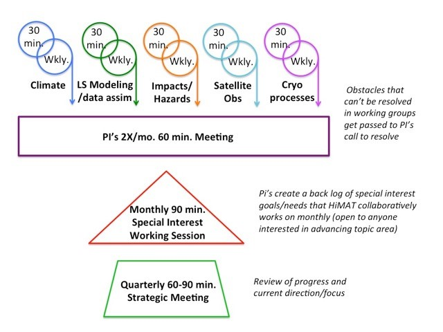

# Remote Meetings

Remote meetings provide opportunities for researchers to stay connected to what is happening on other teams. People can use this time to learn about new datasets, models, manuscripts and plan for upcoming events. Regular remote connections also provide chances for uncovering and eliminating roadblocks to collaboration, and they generally help to build team cohesion and positive social structures.

## Facilitating Remote Meetings

Facilitating remote meetings is often more challenging than in person meetings. We recommend using video conferencing software such as [zoom](https://zoom.us) and inviting people to keep their video on but to mute their sound when not speaking. Zoom also offers capabilities for forming breakout groups within a call which can be used to enable small group discussions within a larger group call. We recommend using the chat function of the video conferencing to help minimize instances of people talking over each other. Screen sharing is an excellent tool for quickly communicating key concepts.

## Meeting Frequency and Timing

Meeting should be scheduled at times that best accommodate the diversity of time zones where team members are located. As for [in-person meetings](InPersonMeetings.md), there should always be an agenda, and the overall purpose for coming together should be well articulated. The duration of a meeting should always be stated in advance, but it should represent a maximum duration only. If there happens to be little to discuss, then the meeting should end early.

!!! note "Structure of HiMAT meetings"
    During the HiMAT project we experimented wtih a communication framework described in the figure below. The idea is to host frequent but short duration communications for detailed science topics, and less frequent but longer duration calls to discuss strategic planning and general project direction. In this figure below, the short, frequent calls would occur within the [topic subgroups](subgroups.md). Roadblocks or opportunities identified during these detailed calls flitered up to the twice-monthly meeting of the Principal Investigators (PIs) of each group. Current challenges and opportunities identified at the PI level motivated the topic of a monthly *Special Interest Working Group*. Then approximately every quarter the full group would gather in a *Strategic Meeting* that would include program managers and other stakeholders.   
    

