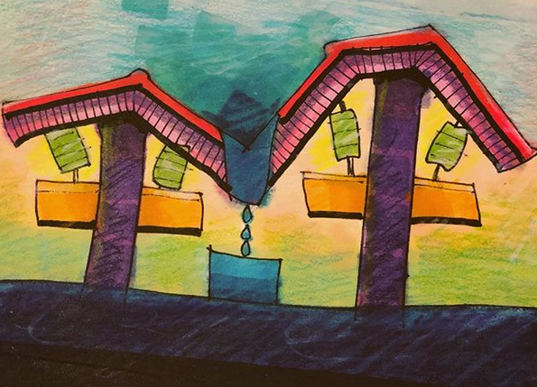

# Overview

Scientists are increasingly being asked to [work collaboratively](https://eos.org/agu-news/convergence-a-call-for-more-robust-global-science-collaboration) to solve complex challenges, but they are rarely offered a roadmap for how to form and sustain functioning teams outside of their existing network of colleagues. Moreover, there are few resources available outlining both the benefits and costs of adding collaborations to an already extensive list of research priorities.

This documentation offers a roadmap for building and sustaining highly collaborative teams. We aim to share lessons learned from leading and facilitating a uniquely collaborative earth science effort funded by NASA beginning in 2016. The participants in this effort formed the NASA High Mountain Asia Team (HiMAT).

<figure style="width:500px; border: 1px solid #000">
    
    <figcaption>Working together to understand complex hydrological systems in the Nepal Himalaya. Artwork by <a href="https://www.instagram.com/p/Bhk2oa3HAAj/?utm_source=ig_web_copy_link">Nicole Delmage</a>.</figcaption>
</figure>

<!--

*When we work together to solve environmental challenges, such as the study of precipitation in the the Nepal Himalaya, our work can be magnified. (artwork by [Nicole Delmage](https://www.instagram.com/p/Bhk2oa3HAAj/?utm_source=ig_web_copy_link))*

-->

